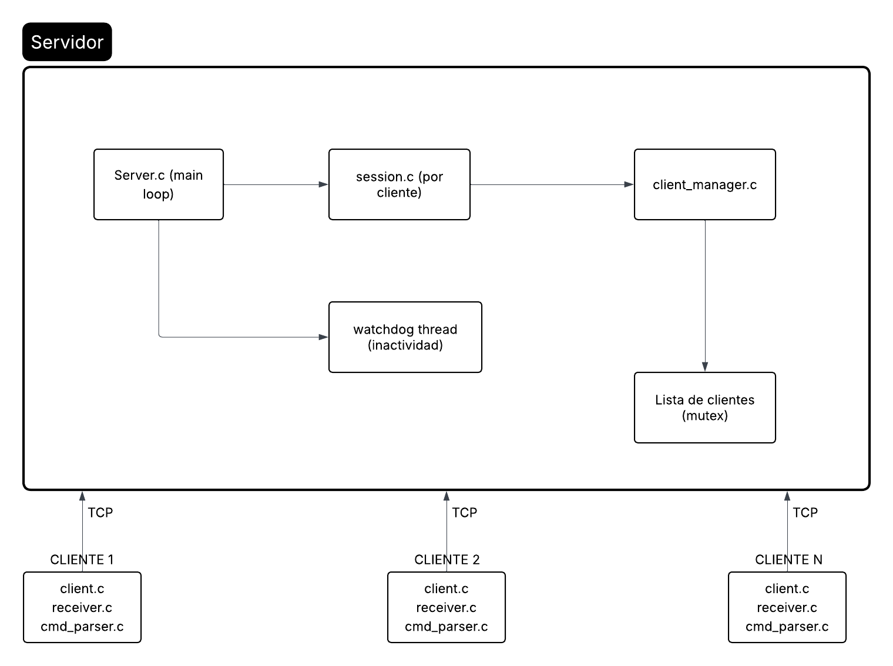

# Chat Multithread — CC3064 Sistemas Operativos

**Universidad del Valle de Guatemala**  
**Facultad de Ingeniería — Departamento de Ciencias de la Computación**  
**CC3064 Sistemas Operativos — Ciclo 1 de 2026**

**Integrantes:**
- Daniela Ramírez de León — 23053
- Leonardo Dufrey Mejía Mejía — 23648
- María José Girón Isidro — 23559

---

## Índice

1. [Descripción General](#descripción-general)
2. [Arquitectura del Sistema](#arquitectura-del-sistema)
3. [Protocolo de Comunicación](#protocolo-de-comunicación)
4. [Estructura de Archivos](#estructura-de-archivos)
5. [Compilación y Ejecución](#compilación-y-ejecución)
6. [Comandos del Cliente](#comandos-del-cliente)
7. [Flujo de Conexión](#flujo-de-conexión)
8. [Multithreading](#multithreading)
9. [Sincronización y Mutex](#sincronización-y-mutex)
10. [Condiciones de Carrera — Análisis y Soluciones](#condiciones-de-carrera--análisis-y-soluciones)
11. [Manejo de Inactividad](#manejo-de-inactividad)
12. [Casos de Uso](#casos-de-uso)
13. [Decisiones de Diseño](#decisiones-de-diseño)
14. [Pruebas en Red Real](#pruebas-en-red-real)
15. [Limitaciones Conocidas](#limitaciones-conocidas)
16. [Referencias](#referencias)

---

## Descripción General

Este proyecto implementa un sistema de **chat cliente-servidor** en C, utilizando **sockets TCP**, **multithreading con pthreads** y **mutex para sincronización**. Permite la comunicación simultánea de múltiples usuarios conectados a la misma red, con soporte para mensajes broadcast, mensajes directos privados, gestión de estados y detección automática de inactividad.

El sistema está dividido en dos ejecutables independientes:
- **`servidor`**: proceso central que gestiona las conexiones, sesiones y enrutamiento de mensajes.
- **`cliente`**: proceso por usuario que se conecta al servidor, se registra y permite enviar/recibir mensajes en tiempo real.

---

## Arquitectura del Sistema



### Modelo de concurrencia

El servidor utiliza un **thread por cliente** (modelo 1:1). Por cada conexión aceptada en el loop principal, se lanza un `pthread_detach` que ejecuta `client_session_thread()`. Adicionalmente, un hilo `inactivity_watchdog_thread` corre en paralelo revisando periódicamente la actividad de los usuarios.

En el cliente, un hilo separado (`receiver_thread`) escucha mensajes entrantes del servidor mientras el hilo principal procesa la entrada del usuario desde `stdin`.

---

## Protocolo de Comunicación

El protocolo es **texto plano delimitado**, diseñado para ser simple, legible y fácil de depurar.

### Formato general

```
COMANDO|arg1|arg2|...\n
```

- Separador de campos: `|`
- Terminador de mensaje: `\n`
- Codificación: ASCII

### Comandos Cliente → Servidor

| Comando | Formato | Descripción |
|---|---|---|
| `REGISTER` | `REGISTER|username\n` | Registra un usuario nuevo |
| `BROADCAST` | `BROADCAST|mensaje\n` | Envía mensaje a todos los usuarios |
| `DIRECT` | `DIRECT|destino|mensaje\n` | Envía mensaje privado a un usuario |
| `LIST` | `LIST\n` | Solicita lista de usuarios conectados |
| `INFO` | `INFO|username\n` | Solicita IP y estado de un usuario |
| `STATUS` | `STATUS|ACTIVO\|OCUPADO\|INACTIVO\n` | Cambia el estado del usuario |
| `EXIT` | `EXIT\n` | Cierra la sesión ordenadamente |

### Respuestas Servidor → Cliente

| Respuesta | Formato | Descripción |
|---|---|---|
| `OK` | `OK|mensaje\n` | Operación exitosa |
| `ERROR` | `ERROR|descripción\n` | Error en la operación |
| `MSG` | `MSG|emisor|destino|contenido\n` | Mensaje recibido (broadcast o directo) |
| `LIST` | `LIST|user1,status;user2,status;...\n` | Lista de usuarios con sus estados |
| `INFO` | `INFO|IP,estado\n` | Información de un usuario específico |
| `DISCONNECTED` | `DISCONNECTED|username\n` | Notificación de desconexión de usuario |

### Estados posibles

| Estado | Descripción |
|---|---|
| `ACTIVO` | Estado por defecto. El usuario está activo. |
| `OCUPADO` | El usuario está ocupado. |
| `INACTIVO` | El usuario lleva más de 20 segundos sin actividad (asignado automáticamente por el servidor). |

### Ejemplo de sesión completa

```
[Cliente → Servidor]
REGISTER|alice\n

[Servidor → Cliente]
OK|Bienvenido alice\n

[Cliente → Servidor]
BROADCAST|Hola a todos!\n

[Servidor → Cliente alice]
OK|Broadcast enviado\n

[Servidor → todos los demás]
MSG|alice|ALL|Hola a todos!\n

[Cliente → Servidor]
DIRECT|bob|Hola bob en privado\n

[Servidor → bob]
MSG|alice|bob|Hola bob en privado\n

[Servidor → alice]
OK|Mensaje enviado\n

[Cliente → Servidor]
LIST\n

[Servidor → Cliente]
LIST|alice,ACTIVO;bob,ACTIVO;\n

[Cliente → Servidor]
INFO|bob\n

[Servidor → Cliente]
INFO|192.168.1.5,ACTIVO\n

[Cliente → Servidor]
STATUS|OCUPADO\n

[Servidor → Cliente]
OK|Status actualizado\n

[Cliente → Servidor]
EXIT\n

[Servidor → Cliente]
OK|Bye\n

[Servidor → todos los demás]
DISCONNECTED|alice\n
```

---

### Responsabilidades por módulo

**`protocolo.h`** — Define todas las cadenas de comandos, respuestas y estados. Es el contrato entre cliente y servidor.

**`client.c`** — Valida argumentos, conecta al servidor, envía `REGISTER`, lanza el hilo receptor e implementa el bucle principal de entrada de usuario.

**`command_parser.c`** — Convierte una línea de texto (ej. `/msg bob hola`) en una estructura `ParsedCommand` con tipo y argumentos. Maneja mayúsculas/minúsculas y valida estados.

**`receiver.c`** — Hilo que llama a `recv()` continuamente y parsea cada línea recibida, mostrando mensajes formateados en consola según el tipo.

**`server.c`** — Crea el socket del servidor, configura `SO_REUSEADDR`, lanza el watchdog y entra en el loop `accept()`. Por cada conexión, crea un thread de sesión.

**`session.c`** — Implementa `client_session_thread()`: recibe datos del cliente, los parsea línea por línea y llama a `handle_command()`. También implementa `inactivity_watchdog_thread()`.

**`client_manager.c`** — Gestiona el arreglo global de clientes con mutex. Provee operaciones atómicas de agregar, eliminar, buscar, actualizar estado y construir listas.

---

## Compilación y Ejecución

### Requisitos

- Sistema operativo **Linux**
- Compilador **GCC** con soporte para C11
- Biblioteca **pthreads** (incluida en la mayoría de distribuciones Linux)

### Compilar

```bash
make
```

Esto genera los ejecutables `servidor` y `cliente` con los flags:
```
-Wall -Wextra -Werror -std=c11 -O2 -pthread
```

### Limpiar

```bash
make clean
```

### Ejecutar el servidor

```bash
./servidor <puerto>
```

**Ejemplo:**
```bash
./servidor 8080
```

**Salida esperada:**
```
[INIT] Client manager inicializado
=====================================
Servidor iniciado correctamente
Puerto: 8080
Esperando conexiones...
=====================================
```

### Ejecutar el cliente

```bash
./cliente <username> <IP_servidor> <puerto>
```

**Ejemplo (misma máquina):**
```bash
./cliente alice 127.0.0.1 8080
```

**Ejemplo (red local):**
```bash
./cliente alice 192.168.1.100 8080
```

**Salida esperada:**
```
[INFO] Conectando a 127.0.0.1:8080...
[INFO] Conexion establecida

Comandos disponibles:
  /broadcast <mensaje>
  /msg <usuario> <mensaje>
  /status <ACTIVO|OCUPADO|INACTIVO>
  /list
  /info <usuario>
  /help
  /exit

> 
```

### Prueba básica con tres terminales

```bash
# Terminal 1
./servidor 8080

# Terminal 2
./cliente alice 127.0.0.1 8080

# Terminal 3
./cliente bob 127.0.0.1 8080
```

---

## Comandos del Cliente

| Comando | Ejemplo | Descripción |
|---|---|---|
| `/broadcast <mensaje>` | `/broadcast Hola a todos` | Envía mensaje a todos los usuarios conectados |
| `/msg <usuario> <mensaje>` | `/msg bob Hola privado` | Envía mensaje directo a un usuario |
| `/status <estado>` | `/status OCUPADO` | Cambia el estado (ACTIVO, OCUPADO, INACTIVO) |
| `/list` | `/list` | Muestra todos los usuarios conectados con su estado |
| `/info <usuario>` | `/info bob` | Muestra IP y estado de un usuario específico |
| `/help` | `/help` | Muestra la lista de comandos disponibles |
| `/exit` | `/exit` | Cierra la conexión y termina el cliente |

**Nota sobre `/status`:** También se aceptan los equivalentes en inglés: `ACTIVE`, `BUSY`, `INACTIVE`. El parser los normaliza automáticamente.

---

## Multithreading

### Modelo del servidor: Thread por cliente

```c
// server.c — por cada conexión aceptada:
pthread_t tid;
pthread_create(&tid, NULL, client_session_thread, args);
pthread_detach(tid);
```

Cada hilo ejecuta `client_session_thread()` de forma completamente independiente. El uso de `pthread_detach` permite que los recursos del hilo se liberen automáticamente al terminar, sin necesidad de `pthread_join`.

El servidor puede manejar hasta **100 clientes simultáneos** (`MAX_CLIENTS = 100`).

### Hilo watchdog de inactividad

```c
// server.c
pthread_t watchdog_tid;
pthread_create(&watchdog_tid, NULL, inactivity_watchdog_thread, NULL);
pthread_detach(watchdog_tid);
```

Este hilo corre indefinidamente, verificando cada 2 segundos si algún usuario ha superado el umbral de inactividad (`INACTIVITY_TIMEOUT = 20` segundos). Si lo detecta, cambia su estado a `INACTIVO` y le envía una notificación.

### Modelo del cliente: Hilo receptor independiente

```c
// client.c
pthread_t rx_tid;
pthread_create(&rx_tid, NULL, receiver_thread, &sockfd);
```

Este hilo recibe y muestra mensajes del servidor de forma asíncrona, mientras el hilo principal del cliente continúa leyendo comandos del usuario desde `stdin`. Sin este modelo, el cliente se bloquearía esperando input del usuario y no podría recibir mensajes entrantes.

---

## Sincronización y Mutex

### Recurso compartido: lista global de clientes

El arreglo `g_clients[MAX_CLIENTS]` en `client_manager.c` es accedido por **múltiples hilos simultáneamente**: cada hilo de sesión puede leer y modificar la lista cuando registra usuarios, elimina sesiones, busca destinatarios o construye listas.

### Mutex global

```c
static pthread_mutex_t g_clients_mutex = PTHREAD_MUTEX_INITIALIZER;
```

**Todas** las funciones de `client_manager.c` adquieren y liberan este mutex usando el patrón:

```c
pthread_mutex_lock(&g_clients_mutex);
// ... operación sobre g_clients ...
pthread_mutex_unlock(&g_clients_mutex);
```

### Operaciones protegidas

| Función | Por qué necesita mutex |
|---|---|
| `cm_add_client()` | Valida duplicados y modifica la lista. Sin mutex, dos registros simultáneos podrían pasar la validación y ambos insertarse. |
| `cm_remove_client()` / `cm_remove_by_sockfd()` | Elimina entradas. Sin mutex, otro hilo podría leer una entrada a medio eliminar. |
| `cm_find_client()` | Lee datos de un cliente. Sin mutex, podría leer un estado inconsistente durante una escritura concurrente. |
| `cm_set_status()` | Modifica el estado de un cliente. |
| `cm_update_activity()` / `cm_reactivate_if_inactive()` | Actualiza `last_activity` y posiblemente el estado. |
| `cm_get_sockets_except()` / `cm_get_socket_by_username()` | Lee descriptores de socket. Un socket podría cerrarse concurrentemente. |
| `cm_build_user_list()` | Itera toda la lista para construir la respuesta. |
| `cm_mark_inactive_clients()` | Llamado por el watchdog. Itera y modifica estados. |

---

## Casos de Uso

### CU-01: Registro de nuevo usuario

**Actor:** Cliente nuevo  
**Precondición:** El servidor está corriendo. El username no existe.  
**Flujo:**
1. Cliente ejecuta `./cliente alice 192.168.1.1 8080`
2. Sistema establece conexión TCP
3. Sistema envía `REGISTER|alice\n`
4. Servidor valida que "alice" y la IP no estén duplicadas
5. Servidor responde `OK|Bienvenido alice\n`
6. Cliente muestra menú de comandos  

**Flujo alternativo — username duplicado:**
- En paso 4: servidor responde `ERROR|Usuario ya existe\n`
- Cliente muestra error y se desconecta

**Flujo alternativo — IP duplicada:**
- En paso 4: servidor responde `ERROR|IP duplicada\n`
- Cliente muestra error y se desconecta

---

### CU-02: Envío de mensaje broadcast

**Actor:** Usuario registrado  
**Precondición:** Al menos dos usuarios conectados  
**Flujo:**
1. Alice escribe `/broadcast Buenos días a todos`
2. Cliente envía `BROADCAST|Buenos días a todos\n`
3. Servidor obtiene todos los sockets excepto el de Alice
4. Servidor envía `MSG|alice|ALL|Buenos días a todos\n` a cada uno
5. Servidor responde a Alice `OK|Broadcast enviado\n`
6. Bob y otros ven `[BROADCAST] alice: Buenos días a todos`

---

### CU-03: Envío de mensaje privado

**Actor:** Usuario registrado  
**Precondición:** El destinatario está conectado  
**Flujo:**
1. Alice escribe `/msg bob Hola en privado`
2. Cliente envía `DIRECT|bob|Hola en privado\n`
3. Servidor busca el socket de "bob"
4. Servidor envía `MSG|alice|bob|Hola en privado\n` a bob
5. Servidor responde a Alice `OK|Mensaje enviado\n`
6. Bob ve `[PRIVADO] alice -> bob: Hola en privado`  

**Flujo alternativo — destinatario no existe:**
- En paso 3: socket no encontrado
- Servidor responde `ERROR|Usuario no encontrado\n`

---

### CU-04: Consulta de lista de usuarios

**Actor:** Usuario registrado  
**Flujo:**
1. Alice escribe `/list`
2. Cliente envía `LIST\n`
3. Servidor construye la lista: `alice,ACTIVO;bob,OCUPADO;charlie,INACTIVO;`
4. Servidor responde `LIST|alice,ACTIVO;bob,OCUPADO;charlie,INACTIVO;\n`
5. Cliente muestra:
   ```
   [USUARIOS]
   alice,ACTIVO;bob,OCUPADO;charlie,INACTIVO;
   ```

---

### CU-05: Consulta de información de usuario

**Actor:** Usuario registrado  
**Flujo:**
1. Alice escribe `/info bob`
2. Cliente envía `INFO|bob\n`
3. Servidor busca a "bob" y obtiene su IP y estado
4. Servidor responde `INFO|192.168.1.5,ACTIVO\n`
5. Cliente muestra:
   ```
   [INFO]
   192.168.1.5,ACTIVO
   ```

---

### CU-06: Cambio de estado

**Actor:** Usuario registrado  
**Flujo:**
1. Alice escribe `/status OCUPADO`
2. Cliente envía `STATUS|OCUPADO\n`
3. Servidor actualiza el estado de Alice a `OCUPADO`
4. Servidor responde `OK|Status actualizado\n`
5. A partir de ese momento, `/list` mostrará `alice,OCUPADO`

---

### CU-07: Detección automática de inactividad

**Actor:** Sistema (watchdog)  
**Precondición:** Usuario lleva 20+ segundos sin enviar comandos  
**Flujo:**
1. Watchdog detecta que Alice lleva >20s sin actividad
2. Watchdog cambia estado de Alice a `INACTIVO`
3. Watchdog envía `MSG|SERVER|alice|Tu status cambio a INACTIVO\n` a Alice
4. Alice ve la notificación en consola
5. Si Alice escribe cualquier comando, su estado vuelve a `ACTIVO`

---

### CU-08: Desconexión limpia

**Actor:** Usuario registrado  
**Flujo:**
1. Alice escribe `/exit`
2. Cliente envía `EXIT\n`
3. Servidor responde `OK|Bye\n`
4. Cliente hace `shutdown(sockfd, SHUT_RDWR)` y `close(sockfd)`
5. En el servidor, `recv()` retorna 0 (EOF)
6. Servidor llama `cm_remove_by_sockfd()` y elimina a Alice
7. Servidor envía `DISCONNECTED|alice\n` a todos los demás usuarios
8. Los demás ven `[AVISO] Usuario desconectado: alice`

---

### CU-09: Desconexión abrupta (fallo de red / Ctrl+C)

**Actor:** Sistema  
**Flujo:**
1. La conexión TCP de Alice se interrumpe abruptamente
2. En el servidor, `recv()` retorna `<= 0` (error o EOF)
3. El hilo de sesión de Alice entra al bloque de limpieza
4. Servidor elimina a Alice de la lista
5. Servidor notifica `DISCONNECTED|alice\n` a todos los demás
6. El hilo de sesión termina y sus recursos se liberan (estaba `pthread_detach`)

---

## Pruebas en Red Real

El sistema fue probado en una red local con un router TP-Link, con múltiples máquinas corriendo Linux conectadas vía Ethernet y Wi-Fi.

### Configuración de prueba

```
[Máquina A: 192.168.1.100] ./servidor 8080
[Máquina B: 192.168.1.101] ./cliente alice 192.168.1.100 8080
[Máquina C: 192.168.1.102] ./cliente bob 192.168.1.100 8080
[Máquina D: 192.168.1.103] ./cliente charlie 192.168.1.100 8080
```

### Problemas encontrados y soluciones

**WSL (Windows Subsystem for Linux):** WSL usa una interfaz de red NAT con IPs en el rango `172.x.x.x`, distinta a la red física. Esto impide que otros equipos se conecten directamente al servidor en WSL. **Solución:** Usar máquinas con Linux nativo o configurar port forwarding en WSL.

**VirtualBox:** Las máquinas virtuales con adaptador NAT no son accesibles desde otras máquinas. **Solución:** Configurar el adaptador de red en modo "Bridged Adapter" para que la VM obtenga una IP en la misma red física.

**Firewall:** En algunas distribuciones, `iptables` o `ufw` bloquean conexiones entrantes. **Solución:** Permitir el puerto del servidor.

---

## Limitaciones Conocidas

1. **Lecturas parciales de TCP:** La implementación actual usa `strtok(buffer, "\n")` para dividir mensajes. Si un mensaje muy largo llega en múltiples `recv()`, podría truncarse. Para mensajes dentro del límite de `MAX_MSG_LEN = 1024` bytes, esto no ocurre en redes locales.

2. **`net_utils.c` no completamente integrado:** Las funciones `send_all()` y `recv_all()` están disponibles pero la implementación principal usa `send()` y `recv()` directamente. Para mayor robustez en redes con alta latencia, se podría migrar a `send_all`.

3. **IP duplicada:** El servidor rechaza conexiones desde la misma IP aunque sean usuarios distintos. Esto impide correr dos instancias del cliente en la misma máquina para pruebas. Se puede modificar `cm_add_client()` eliminando la validación de IP duplicada si se desea mayor flexibilidad.

4. **Sin cifrado:** Las comunicaciones son texto plano sin TLS/SSL. El sistema es adecuado para redes locales confiables pero no para Internet.

5. **Sin persistencia:** La lista de usuarios y mensajes se mantiene solo en memoria. Al reiniciar el servidor, toda la información se pierde.

